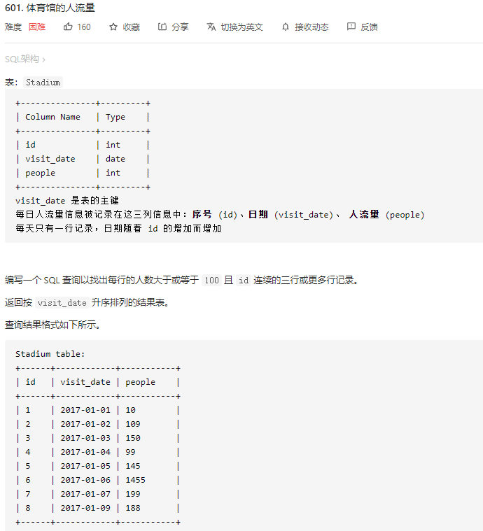
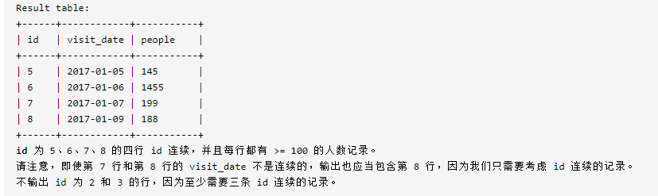
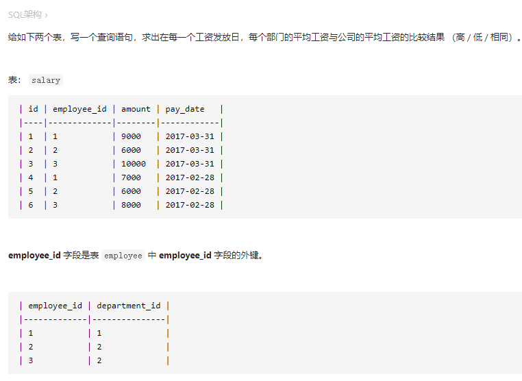
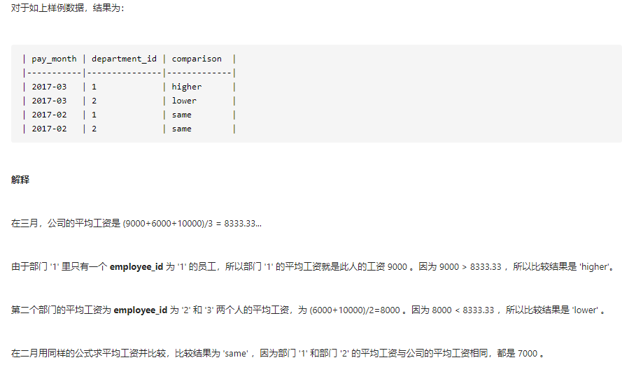
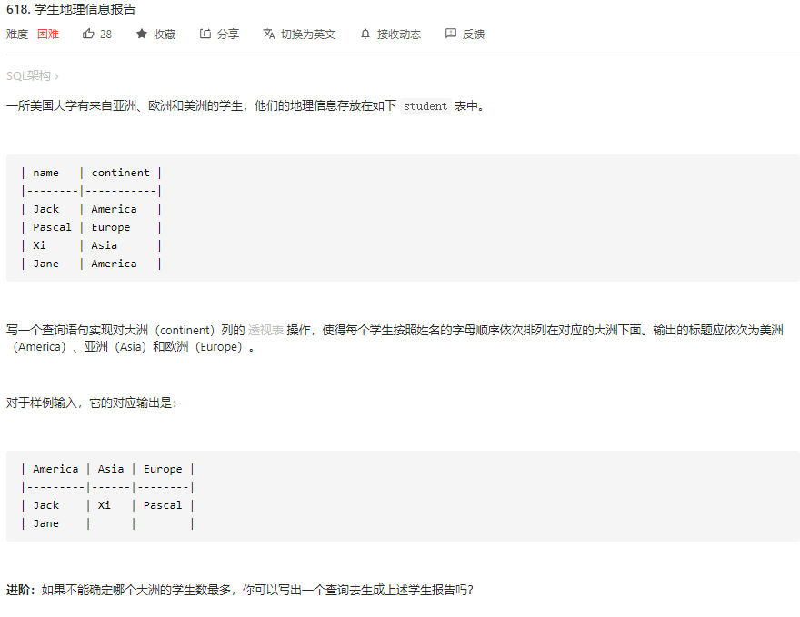

leetcode sql刷题

## 185

编写一个 SQL 查询，找出每个部门获得前三高工资的所有员工

```
# Write your MySQL query statement below
select
d.Name as Department
,a.Name as Employee
,a.Salary
from
Department d join
    (
        select
        *
        ,dense_rank() over(partition by DepartmentId order by Salary desc) as rk
        from Employee
    ) a 
on d.Id = a.DepartmentId
where a.rk in (1,2,3)
order by d.Name,a.Salary desc
```

## 262

写一段 SQL 语句查出 `"2013-10-01"` 至 `"2013-10-03"` 期间非禁止用户（**乘客和司机都必须未被禁止**）的取消率。

```
# Write your MySQL query statement below
SELECT a.Request_at as 'Day', 
    ROUND(SUM(
        CASE WHEN a.Status!='completed' THEN 1
        ELSE 0
        END
    ) / 
    COUNT(
        *
    ), 2) as 'Cancellation Rate'
FROM 
    Trips a 
    JOIN Users b on (a.Client_id=b.users_id AND b.Banned='No')
WHERE a.Request_at BETWEEN '2013-10-01' AND '2013-10-03'
GROUP BY a.Request_at
```

## 569

请编写SQL查询来查找每个公司的薪水中位数。挑战点：你是否可以在不使用任何内置的SQL函数的情况下解决此问题。

```
# Write your MySQL query statement below
select
t.Id
,t.Company
,t.Salary
from
(
    select
    *
    ,row_number() over(partition by Company order by Salary) as rk
    ,count(Salary) over(partition by Company) as num
    from Employee
) t
where rk between num/2 and num/2+1
```

## 571


```
# Write your MySQL query statement below
select
avg(tem.Number) as median
from 
(
    select
    *
    ,sum(Frequency) over(order by `Number` asc) as fre
    ,sum(Frequency) over() as num
    from Numbers
) tem
where tem.fre >= tem.num/2
and tem.fre <= tem.num/2 + tem.Frequency 
```

## 579


```mysql
# Write your MySQL query statement below
select 
Id
,Month
,Salary
from 
(
    select 
    Id
    ,Month
    ,sum(Salary) over(partition by Id order by Month asc rows between  2 preceding and current row) as Salary -- 三个月内的累计工资
    ,rank() over(partition by Id order by Month desc ) rk -- 剔除每个人最近的一个月记录
    from 
    Employee
) tem 
where rk != 1
order by Id,Month desc
```

## 601





```mysql
select
id
,visit_date
,people
from (
    select
    *
    ,id - rank() over (order by id) as rk 
    from Stadium
    where people >=100
) as tem 
where rk in 
    (
        select rk
        from (
                select
                *
                ,id - rank() over (order by id) as rk 
                from Stadium
                where people >=100
            ) tem
        group by rk 
        having count(1)>=3
    )
    
    -- 解题思路 id - rk 相同值就表示了连续的记录
    
    
-- 方法二
select distinct t2.*    
from(
    select *, 
    lead(people,1)over(order by visit_date  ) as p2,-- 前一天人数
    lead(people,2)over(order by visit_date ) as p3 -- 后一天人数
    from Stadium 
)t, Stadium t2
where t.people >=100 and p2>=100 and p3>=100 and -- 连续三天人数都大于100
t2.id>=t.id and t2.id-2<=t.id -- 判断一条记录是否是连续记录中一条，因为对连续的三条记录而言，往前数两个才是第一个数据

```

- mysql创建临时表

- ```
  with t1 as (
  select
      **
  )
  其它select语句，可以直接使用t1作为表名
  ```

## 615





```mysql
# Write your MySQL query statement below
select
pay_month
,department_id
,comparison
from 
    (   select
        *
        ,case when avg_amount > avg_amount_all then 'higher' -- case语句判断状态
            when avg_amount = avg_amount_all then 'same'
            else 'lower'
            end as comparison
        ,DATE_FORMAT(pay_date,'%Y-%m') as pay_month -- 调整日期格式
        from
        (
            select
            s.*
            ,e.department_id
            ,avg(amount) over(partition by pay_date,e.department_id) as avg_amount -- 每个工资发放日，每个部门的平均工资
            ,avg(amount) over(partition by pay_date) as avg_amount_all -- 每个工资发放日，平均工资
            from salary s
            join employee e 
                on s.employee_id = e.employee_id
        ) as tem
    ) as tem2
group by pay_month,department_id,comparison
order by pay_month desc,department_id
```

- mysql常用函数：[mysql常用函数](https://www.runoob.com/mysql/mysql-functions.html)

## 618



```mysql
# Write your MySQL query statement below
select
max(case when continent = 'America' then name else null end) as America,
max(case when continent = 'Asia' then name else null end)as Asia,
max(case when continent = 'Europe' then name else null end) as Europe
from 
(select *, row_number() over(partition by continent order by name) rk
from student) t
group by rk

-- 方法2
# Write your MySQL query statement below
select 
max(case continent when 'America' then name else null end) America,
max(case continent when 'Asia' then name else null end) Asia,
max(case continent when 'Europe' then name else null end) Europe
from
(   select 
    name
    ,continent
    ,if(@tmp=continent,@rownum:=@rownum+1,@rownum:=1) as rnk
    ,@tmp:=continent 
 	from student s1
    ,(select @tmp:=0,@rownum:=1) r1 -- 定义变量初始值，0，1
    order by continent,name asc
) t
group by rnk
```

- mysql 变量的使用：[链接](https://www.php.cn/mysql-tutorials-414071.html)
- mysql 变量的种类:[链接](https://www.cnblogs.com/aixinyiji/p/11033297.html)