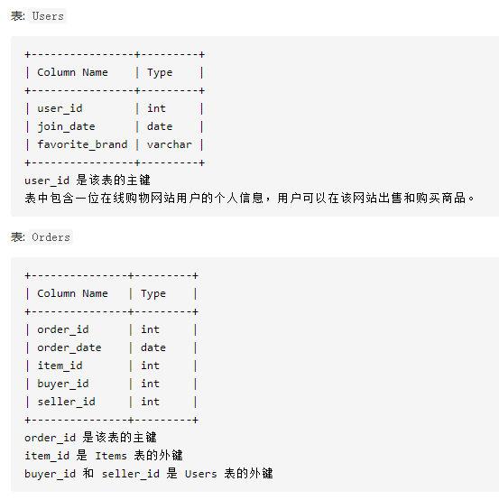
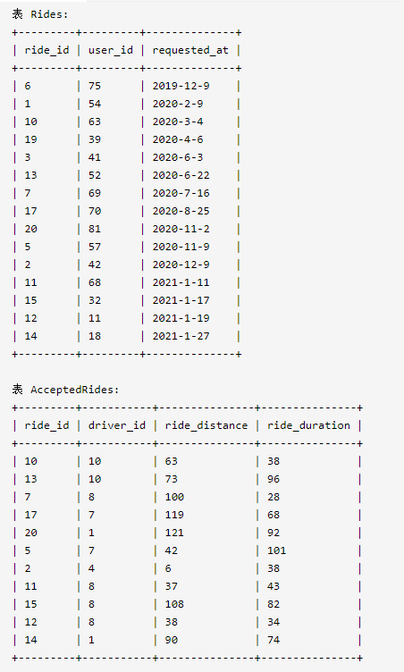
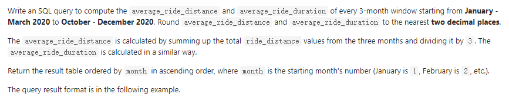

leetcode sql刷题

## 185

编写一个 SQL 查询，找出每个部门获得前三高工资的所有员工

```mysql
# Write your MySQL query statement below
select
d.Name as Department
,a.Name as Employee
,a.Salary
from
Department d join
    (
        select
        *
        ,dense_rank() over(partition by DepartmentId order by Salary desc) as rk  -- 开窗函数生成部门内工资排名
        from Employee
    ) a 
on d.Id = a.DepartmentId
where a.rk in (1,2,3)
order by d.Name,a.Salary desc
```

## 262

写一段 SQL 语句查出 `"2013-10-01"` 至 `"2013-10-03"` 期间非禁止用户（**乘客和司机都必须未被禁止**）的取消率。


```mysql
# Write your MySQL query statement below
SELECT a.Request_at as 'Day', 
    ROUND(SUM(
        CASE WHEN a.Status!='completed' THEN 1 -- 统计订单取消的数量
        ELSE 0
        END
        ) 
          / 
        COUNT(*), -- 每天的总订单量
          2) as 'Cancellation Rate'
FROM 
    Trips a 
    JOIN Users b on (a.Client_id=b.users_id AND b.Banned='No') -- 筛选被ban的用户
WHERE a.Request_at BETWEEN '2013-10-01' AND '2013-10-03'
GROUP BY a.Request_at
```

## 569

请编写SQL查询来查找每个公司的薪水中位数。挑战点：你是否可以在不使用任何内置的SQL函数的情况下解决此问题。


```mysql
# Write your MySQL query statement below
select
t.Id
,t.Company
,t.Salary
from
(
    select
    *
    ,row_number() over(partition by Company order by Salary) as rk -- 每个公司内的工资排名
    ,count(Salary) over(partition by Company) as num -- 每个公司内的总人数
    from Employee
) t
where rk between num/2 and num/2+1 -- 介于总人数/2 和总人数/2+1 之间的排名就是中位数
```

## 571


```mysql
# Write your MySQL query statement below
select
avg(tem.Number) as median
from 
(
    select
    *
    ,sum(Frequency) over(order by `Number` asc) as fre   -- 累计频率
    ,sum(Frequency) over() as num  -- 总数量
    from Numbers
) tem
where tem.fre >= tem.num/2  -- 判断中位数
and tem.fre <= tem.num/2 + tem.Frequency 
```

## 579


```mysql
# Write your MySQL query statement below
select 
Id
,Month
,Salary
from 
(
    select 
    Id
    ,Month
    ,sum(Salary) over(partition by Id order by Month asc rows between  2 preceding and current row) as Salary -- 三个月内的累计工资
    ,rank() over(partition by Id order by Month desc ) rk -- 剔除每个人最近的一个月记录
    from 
    Employee
) tem 
where rk != 1
order by Id,Month desc
```

## 601


```mysql
select
id
,visit_date
,people
from (
    select
    *
    ,id - rank() over (order by id) as rk 
    from Stadium
    where people >=100
) as tem 
where rk in 
    (
        select rk
        from (
                select
                *
                ,id - rank() over (order by id) as rk 
                from Stadium
                where people >=100
            ) tem
        group by rk 
        having count(1)>=3
    )
    
    -- 解题思路 id - rk 相同值就表示了连续的记录
    
    
-- 方法二
select distinct t2.*    
from(
    select *, 
    lead(people,1)over(order by visit_date  ) as p2,-- 前一天人数
    lead(people,2)over(order by visit_date ) as p3 -- 后一天人数
    from Stadium 
)t, Stadium t2
where t.people >=100 and p2>=100 and p3>=100 and -- 连续三天人数都大于100
t2.id>=t.id and t2.id-2<=t.id -- 判断一条记录是否是连续记录中一条，因为对连续的三条记录而言，往前数两个才是第一个数据

```

- mysql创建临时表

- ```
  with t1 as (
  select
      **
  )
  其它select语句，可以直接使用t1作为表名
  ```

## 615


```mysql
# Write your MySQL query statement below
select
pay_month
,department_id
,comparison
from 
    (   select
        *
        ,case when avg_amount > avg_amount_all then 'higher' -- case语句判断状态
            when avg_amount = avg_amount_all then 'same'
            else 'lower'
            end as comparison
        ,DATE_FORMAT(pay_date,'%Y-%m') as pay_month -- 调整日期格式
        from
        (
            select
            s.*
            ,e.department_id
            ,avg(amount) over(partition by pay_date,e.department_id) as avg_amount -- 每个工资发放日，每个部门的平均工资
            ,avg(amount) over(partition by pay_date) as avg_amount_all -- 每个工资发放日，平均工资
            from salary s
            join employee e 
                on s.employee_id = e.employee_id
        ) as tem
    ) as tem2
group by pay_month,department_id,comparison -- 剔除重复值
order by pay_month desc,department_id
```

- mysql常用函数：[mysql常用函数](https://www.runoob.com/mysql/mysql-functions.html)

## 618


```mysql
# Write your MySQL query statement below
select
max(case when continent = 'America' then name else null end) as America,
max(case when continent = 'Asia' then name else null end)as Asia,
max(case when continent = 'Europe' then name else null end) as Europe
from 
(select *, row_number() over(partition by continent order by name) rk
from student) t
group by rk

-- 方法2
# Write your MySQL query statement below
select 
max(case continent when 'America' then name else null end) America,
max(case continent when 'Asia' then name else null end) Asia,
max(case continent when 'Europe' then name else null end) Europe
from
(   select 
    name
    ,continent
    ,if(@tmp=continent,@rownum:=@rownum+1,@rownum:=1) as rnk
    ,@tmp:=continent 
 	from student s1
    ,(select @tmp:=0,@rownum:=1) r1 -- 定义变量初始值，0，1
    order by continent,name asc
) t
group by rnk
```

- mysql 变量的使用：[链接](https://www.php.cn/mysql-tutorials-414071.html)
- mysql 变量的种类:[链接](https://www.cnblogs.com/aixinyiji/p/11033297.html)

## 1097


```mysql
# Write your MySQL query statement below
-- 方法1 使用左连接
select a1.install_dt,
       count(*) installs,
       round(count(a2.event_date)/count(*),2) Day1_retention -- a2.event-date空值null会自动忽略
from(
    select 
    player_id
    ,min(event_date) install_dt -- 每个玩家的初始登陆日期
    from Activity
    group by player_id
    ) a1
left join Activity a2  -- 使用左连接保留第二天没有登陆的人
    on a1.player_id = a2.player_id 
    and datediff(a2.event_date,a1.install_dt)=1
group by a1.install_dt

-- 方法2使用if语句
select first_date as install_dt,
count(distinct player_id) as installs,
round(
        sum(if(datediff(event_date,first_date)=1,1,0)) -- 判断第二天是否登陆
        /
        count(distinct player_id)
    ,2)
as Day1_retention
from
(
    select player_id
    ,event_date
    ,min(event_date) over(partition by player_id) as first_date -- 每个用户的初始注册日期
    from activity
)tmp
group by first_date
```

## 1127


```mysql

select 
temp1.spend_date
, temp1.platform 
,ifnull(temp3.total_amount, 0) total_amount-- 若不存在记录则为零
,ifnull(temp3.total_users,0) total_users
from
(
    select 
    distinct(spend_date), p.platform   
    from Spending,
    (select 'desktop' as platform union
    select 'mobile' as platform union
    select 'both' as platform
    ) as p -- 两个表产生笛卡尔积，也就是spending中的每一条记录都对应三个终端类型
) as temp1
left join -- 避免出现某种类型数量为零的情况被剔除掉
(
    select spend_date,platform
    , sum(amount) as total_amount -- 2聚合操作得到每天的总金额和总用户数量
    , count(user_id) total_users
    from
        (select 
        spend_date
        , user_id, 
        (case count(distinct platform)  -- 1判断他的使用终端的数量的类型
            when 1 then platform
            when 2 then 'both'
            end
        ) as  platform
        , sum(amount) as amount -- 1统计每个人每天使用终端的种类数量
        from Spending
        group by spend_date, user_id -- 1按照日期和用户分组
        ) as temp2
    group by spend_date, platform -- 2 按照日期和终端使用类型进行分组
) as  temp3
on temp1.platform = temp3.platform and temp1.spend_date = temp3.spend_date


-- 方法2
select 
spend_date,
b.platform,
sum(if(a.platform=b.platform,amount,0)) as total_amount, -- 第二次汇总金额
count(if(a.platform=b.platform,1,null)) as total_users -- 
from(
        select 
        spend_date,
        user_id,
        if(count(distinct platform)=2,'both',platform) as platform,-- 标记每个人的终端使用类型
        sum(amount) as amount -- 第一次汇总统计金额
        from spending
        group by user_id,spend_date -- 注意按照id和日期分组
    ) a,
    (
        select 'desktop' as platform union
        select 'mobile' as platform union
        select 'both' as platform
    ) b
group by spend_date,platform -- 注意按照日期和生成的终端使用类型进行分组

```


## 1159




```mysql
# Write your MySQL query statement below
with t1 as -- 创建临时表存储结果为‘yes'的记录
(select * from
    (
        select
        seller_id
        ,order_id
        ,item_brand
        ,row_number() over(partition by seller_id order by order_date) as rk -- 卖出的第rk件商品
        from Orders o
        join Items i
           on o.item_id = i.item_id
    )tem 
    join Users u 
    on u.user_id = tem.seller_id
    where rk =2
        and tem.item_brand = u.favorite_brand  -- 筛选出第二件
)

select
seller_id
, `2nd_item_fav_brand`
from (
        select 
        seller_id
        , 'yes' as `2nd_item_fav_brand`
        from t1 -- ’yes'的结果

        union -- 将结果求个并集

        select
        user_id as seller_id
        ,'no' as `2nd_item_fav_brand` -- no的结果
        from Users
        where user_id not in 
            (
                select
                seller_id
                from 
                t1
            )
    ) tem
order by seller_id


-- 方法2 使用case语句判断yes和no

SELECT 
u.user_id AS seller_id
,CASE WHEN u.favorite_brand = t.item_brand THEN 'yes' ELSE 'no' END AS 2nd_item_fav_brand
FROM users u
LEFT JOIN(
    SELECT
    seller_id
    , item_brand
    , RANK() OVER(PARTITION BY seller_id ORDER BY order_date ASC) AS `rank`
    FROM orders o
    LEFT JOIN items i
    ON o.item_id = i.item_id
) t
ON u.user_id = t.seller_id
AND t.rank = 2
```


## 1194


```mysql
# Write your MySQL query statement below
with t as 
(
        select 
        p.group_id
        ,p.player_id
        ,sum(score) as score
        from 
        (
            select
            first_player as player
            ,first_score as score
            from
            Matches

            union all -- 注意加上all,否则默认会进行去重操作，并得到错误结果

            select
            second_player as player
            ,second_score as score
            from
            Matches
        ) as tem
        join Players p 
            on tem.player = p.player_id
        group by p.group_id,p.player_id
    )

select
group_id AS GROUP_ID
,player_id AS PLAYER_ID
from 
    (
        select
        *
        ,row_number() over(partition by group_id order by score desc,player_id asc) as rk
        from t 
    ) as tem2
where rk = 1
-- order by group_id
```

## 1225


```mysql
select state as period_state,min(dt) as start_date,max(dt) as end_date 
from 
(
    select
    *
    ,date_sub(dt,interval rank() over(partition by state order by dt) day) as dif -- 筛选
    from 
        (
            select 
            fail_date as dt
            ,'failed' as state
            from Failed
            where fail_date between '2019-01-01' and '2019-12-31'

            union all

            select 
            success_date as dt
            ,'succeeded' as state
            from Succeeded
            where success_date between '2019-01-01' and '2019-12-31'
        ) t1 
) t2 
group by state,dif 
order by dt
```

- 一般筛选连续数的时候，都是用此列的数据减去rank（）差相同的就是连续的数据

## 1336


```mysql
# Write your MySQL query statement below
select
round(t2.idx,0) as transactions_count
,count(visit_date) as visits_count
from 
(
    select
    count(t.transaction_date) as transactions_count -- 每个用户在每个访问日的交易数量
    ,visit_date
    ,v.user_id
    from Visits v 
    left join Transactions t 
        on v.user_id = t.user_id
        and v.visit_date = t.transaction_date
    group by v.visit_date,v.user_id
) t1
right join -- 避免没有交易次数1，3，中间出现空缺的情况
(
    select 0 idx -- 补充零

    union all

    select
    @i := @i+ 1 -- 每次选出一行，则累加1
    from 
    Transactions,(select @i := 0) val -- 定义变量
    where @i < -- 定义截至条件
        (
            select count(*) transactions_count
            from transactions 
            group by user_id, transaction_date
            order by transactions_count desc
            limit 1
        )
) t2
on t1.transactions_count = t2.idx
group by t2.idx
```

## 1384


```mysql
with recursive y(n) as ( -- n是列名
    select 
    min(year(period_start)) -- 找出最小年
    from sales 

    union all 

    select n+1 
    from y
    where n<=  -- 递归生成每一年
    (
        select 
        max(year(period_end)) 
        from sales
        )
)

select 
distinct cast(p.product_id as char) product_id
,p.product_name product_name
,cast(n as char) report_year -- n是y表中的列名，表示年份
,if(n=year(period_start)and n=year(period_end),(datediff(period_end,period_start)+1)*average_daily_sales,-- s=n=e
    if(n=year(period_start),(datediff(concat(n,'-12-31'),period_start)+1)*average_daily_sales,-- s=n
        if(n=year(period_end),(datediff(period_end,concat(n,'-01-01'))+1)*average_daily_sales, -- n=e
           365*average_daily_sales))) total_amount -- 其他的整年情况
from product p 
join y 
left join sales s 
    on p.product_id=s.product_id
where year(period_start)<=n and year(period_end)>=n  -- 删除每个每个记录中时间不符合的记录
order by product_id,REPORT_YEAR
```


## 1412


```mysql
-- 方法1
select
distinct
e.student_id as STUDENT_ID
,s.student_name AS STUDENT_NAME
from  Exam e 
join Student s 
on e.student_id = s.student_id
where e.student_id not in
    (
        select
        student_id
        from 
        (
            select
            student_id
            ,score
            ,max(score) over(partition by exam_id) as max_score
            ,min(score) over(partition by exam_id) as min_score
            from 
            Exam
        )tem1
        where score = max_score -- 筛选出最高成绩
        or score = min_score
    )
order by e.student_id

-- 方法2
select 
t1.student_id
,s.student_name
from
(
    select *,
    if(dense_rank() over(partition by exam_id order by score desc)=1,1,0) d_rank,-- 成绩排名倒序
    if(dense_rank() over(partition by exam_id order by score )=1,1,0) a_rank -- 成绩排名正序
    from Exam
) t1 
left join Student s 
	on t1.student_id =s.student_id
group by t1.student_id
having sum(d_rank)=0 
	and sum(a_rank)=0
order by student_id

```

## 1419


```mysql
# Write your MySQL query statement below
select
item_category CATEGORY
,sum(if(date_format(order_date, '%W') = 'Monday',quantity,0)) as MONDAY
,sum(if(date_format(order_date, '%W') = 'Tuesday',quantity,0)) as TUESDAY
,sum(if(date_format(order_date, '%W') = 'Wednesday',quantity,0)) as WEDNESDAY
,sum(if(date_format(order_date, '%W') = 'Thursday',quantity,0)) as THURSDAY
,sum(if(date_format(order_date, '%W') = 'Friday',quantity,0)) as FRIDAY
,sum(if(date_format(order_date, '%W') = 'Saturday',quantity,0)) as SATURDAY
,sum(if(date_format(order_date, '%W') = 'Sunday',quantity,0)) as SUNDAY
from
Orders o 
right join Items i 
on o.item_id = i.item_id
group by item_category
order by item_category

-- 方法2
select item_category category,
        sum(if(weekday(order_date)=0,quantity,0)) 'Monday',
        sum(if(weekday(order_date)=1,quantity,0)) 'Tuesday',
        sum(if(weekday(order_date)=2,quantity,0)) 'Wednesday',
        sum(if(weekday(order_date)=3,quantity,0)) 'Thursday',
        sum(if(weekday(order_date)=4,quantity,0)) 'Friday',
        sum(if(weekday(order_date)=5,quantity,0)) 'Saturday',
        sum(if(weekday(order_date)=6,quantity,0)) 'Sunday'
from orders o right join items i 
on o.item_id = i.item_id
group by item_category
order by category
```


## 1635





```mysql
# Write your MySQL query statement below
with recursive y (n) as -- 生成12个月份
( -- n是列名
    select 1
    union all 
    select n+1 
    from y
    where n+1<= 12
)
select
tem1.month
,tem2.active_drivers
,tem1.accepted_rides
from 
(
    select
    y.n as 'month'
    ,count(a.ride_id) as accepted_rides
    from  
        AcceptedRides a 
    join 
        (
            select
            *
            ,month(requested_at) as m -- 生成月份
            from Rides
            where year(requested_at) = 2020
        ) r 
        on r.ride_id = a.ride_id
    right join y
        on y.n = r.m 
    group by y.n
)tem1
join 
(
    select 
    y.n as 'month'
    ,count(driver_id) as active_drivers
    from y 
    left join Drivers d  -- 通过生成笛卡尔积的方法，利用筛选条件，和分组，来求累计和
    on 202000+n >= Date_format(join_date,'%Y%m')
    group by y.n
)tem2
on tem1.month = tem2.month
order by tem1.month
```


```mysql
# Write your MySQL query statement below
with recursive y (n) as -- 生成月份
(
    select 1 
    union all
    select n +1 
    from y
    where n+1<= 12
)

select 
tem1.month
,ifnull(round(a_num/d_num*100,2),0) as working_percentage 
from 
(
    select 
    y.n as month
    ,count(driver_id) as d_num -- 每个月的可用员工数量
    from y 
    left join Drivers d 
        on 202000 + n >= date_format(join_date,'%Y%m')
    group by n
)tem1
join
(
    select
    y.n as month
    ,count(distinct driver_id) as a_num -- 每个月有接单员工数量
    from  
        AcceptedRides a 
    join 
        (
            select
            *
            ,month(requested_at) as m -- 生成月份
            from Rides
            where year(requested_at) = 2020
        ) r 
        on r.ride_id = a.ride_id
    right join y
        on y.n = r.m
    group by n
)tem2
on tem1.month = tem2.month
order by tem1.month
```





```mysql
# Write your MySQL query statement below
with recursive tmp(n) as (
    select 1
    union all
    select n+1 from tmp where n < 12
)
select
month,
round(avg(ride_distance) over(order by month rows between current row and 2 following), 2) average_ride_distance,
round(avg(ride_duration) over(order by month rows between current row and 2 following), 2) average_ride_duration
from
(
    select
    t.n month,
    ifnull(sum(ride_distance), 0) ride_distance,
    ifnull(sum(ride_duration), 0) ride_duration
    from
    acceptedrides a join rides r on a.ride_id = r.ride_id and year(requested_at) = '2020'
    right join tmp t on t.n = month(requested_at)
    group by t.n
) as t limit 10
```

## 1767


```mysql
# Write your MySQL query statement below
with recursive num (n) as
(
    select 1
    union all
    select n+1
    from
    num
    where 
        n+1 <=
        (
            select max(subtasks_count)
            from Tasks
        )
)
select 
tem.*
from 
(select 
t.task_id
,num.n as subtask_id
from 
Tasks t
join num
    on num.n <= subtasks_count
) tem
left join Executed e 
    on tem.task_id = e.task_id
    and tem.subtask_id = e.subtask_id
where e.subtask_id is null
order by tem.task_id,tem.subtask_id
```

