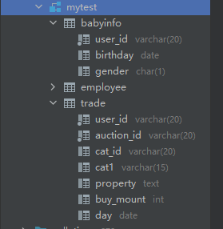
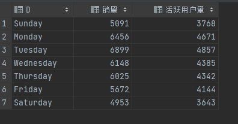

1 导入数据到数据库


创建Trade表

```

create table trade
(
	user_id varchar(20) not null comment '用户id',
	auction_id varchar(20) not null comment '购买行为编号',
	cat_id varchar(20) null comment '商品所属的大类下的子类',
	cat1 varchar(15) null comment '商品所属的大类',
	property text null comment '商品属性',
	buy_mount int null comment '购买数量',
	day varchar(8) null comment '购买日期'
);

```

导入数据

创建babyinfo表

```
create table babyinfo
(
	user_id varchar(20) not null,
	birthday varchar(8) null,
	gender char null
);
```

导入数据


然后再在DataGrip修改日期数据的数据格式为date




数据探索：

Trade表

统计缺失值信息

```
select
       sum(user_id is null)
       ,sum(auction_id is null)
       ,sum(cat1 is null)
       ,sum(cat_id is null)
       ,sum(trade.property is null)
       ,sum(trade.buy_mount is null)
       ,sum(trade.day is null)
from trade;

```


- 只有144条记录的商品属性property有缺失

用户数量：

```
select
       count(user_id)
      ,count(distinct user_id)
from trade;
```


统计不同购买数量的用户

```
select
buy_num
,count(user_id) as user_num
from
(
    select
    user_id
    ,count(user_id) as buy_num
    from trade
    group by user_id
    )as tem
group by buy_num
order by user_num;
```


商品类别

```
select
       cat1,
       count(distinct cat_id) as 子类数量
from trade
group by cat1
order by 子类数量;
```


每次购买数量

```
select
       buy_mount 每次购买数量
       ,count(user_id) 消费次数
from trade
group by buy_mount
order by 消费次数;

```


时间跨度

```
select max(day),
       min(day)
from trade;
```


babyinfo表

缺失值统计

```

select sum(user_id is null),
       sum(birthday is null),
       sum(gender is null)
from babyinfo;
```


有信息的用户数量

```
select count(distinct user_id) -- 有信息的用户数量
from babyinfo;
```


不同性别婴儿的数量

```

select gender, -- 不同性别的数量
       count(gender)
from babyinfo
group by gender;
```


数据分析与可视化

购买情况

按天统计每天的销量和每天

```
select day,
       sum(buy_mount) as 销量,
       count(distinct user_id) as 用户数量
from mytest.trade
group by day
order by day
```

使用tableau进行可视化


查看销量异常多的销售日期

每年销量前三的日期统计


查询销量异常记录：

```
-- 查询单次购买超过100的记录数
select user_id,day,
       buy_mount
from trade
where buy_mount>100
order by buy_mount desc ;
```


更改连接sql语句，重新查询后，销量用户数量图如下：

> 婴幼儿在0-1岁时，理论上一共需要81罐400g奶粉，假设用户除“双十一”、“618”外其他时间每次只购买1罐，那么两个购物节平均需要承担27罐奶粉，向上取整后，以单笔销量超过30罐奶粉作异常值处理。

```
select day,
       sum(buy_mount) as 销量,
       count(distinct user_id) as 用户数量
from mytest.trade
where buy_mount < 30
group by day
order by day
```


观察销量在一周内的变化

```
-- 分析按星期的销量，用户量
select dayname(day) as D,
       sum(buy_num) as 销量,
       sum(user_num) as 活跃用户量
from
    (
        select
            day,
            sum(buy_mount ) as buy_num,
            count(distinct user_id) as user_num
        from trade
        where buy_mount<30
        group by day
        ) as tem
group by D,dayofweek(day)
order by dayofweek(day) ;

```




分析按月购买的情况：

```
-- 分析按月购买的情况
select
       月份,
       max(if(年份 = 2012,buy_num,0)) as 2012年,
       max(if(年份 = 2013,buy_num,0)) as 2013年,
       max(if(年份 = 2014,buy_num,0)) as 2014年,
       max(if(年份 = 2015,buy_num,0)) as 2015年
from
    (
        select
        month(day) as 月份,
        year(day) as 年份,
        sum(buy_mount ) as buy_num,
        count(distinct user_id) as user_num
        from trade
        where buy_mount<30
        group by year(day), month(day)
        ) as tem
group by 月份
order by 月份;
```


销量与季度


每个大类奶粉的购买情况

```
-- 每个大类奶粉的购买情况
select
       cat1 as 类别,
        sum(buy_mount) as 销量,
       count(distinct user_id) as 用户数
from trade
where buy_mount<30
group by cat1
order by cat1;
```


-- 找到热销的子类信息

```
-- 寻找热销子类（销量前十或用户数量前十）
select
tem1.*,
用户量排名, 用户量
from
         (select cat_id,
                 @j := @j + 1 as 销量排名,
                 销量
          from (select @j := 0) as t,
               (
                   select cat_id,
                          sum(buy_mount) as 销量
                   from trade
                   where buy_mount < 30
                   group by cat_id
                   order by sum(buy_mount) desc) as n
         ) as tem1

join
         (select cat_id,
                 @i := @i + 1 as 用户量排名,
                 用户量
          from (select @i := 0) as t,
               (
                   select cat_id,
                          count(distinct user_id ) as 用户量
                   from trade
                   where buy_mount < 30
                   group by cat_id
                   order by count(distinct user_id ) desc) as m
         ) as tem2
on tem1.cat_id = tem2.cat_id
where 销量排名<10 or 用户量排名<10;
```


通过tableau可以清晰地查看不同子类销售量的变化趋势，从而采取不同的措施，来提高销量