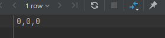

>本文数据集来源：[Baby Goods Info Data](https://tianchi.aliyun.com/dataset/dataDetail?dataId=45)
>
>数据库：MySQL
>
>数据库管理软件：DataGrip
>
>可视化分析软件:Tableau
>
>本文sql文件、可视化分析源文件地址:[DataScience](https://github.com/pandali1/DataScience/tree/main/%E6%95%B0%E6%8D%AE%E5%88%86%E6%9E%90%E9%A1%B9%E7%9B%AE)

# 数据预处理与导入

## 导入数据到数据库

1. 创建Trade表

```mysql

create table trade
(
	user_id varchar(20) not null comment '用户id',
	auction_id varchar(20) not null comment '购买行为编号',
	cat_id varchar(20) null comment '商品所属的大类下的子类',
	cat1 varchar(15) null comment '商品所属的大类',
	property text null comment '商品属性',
	buy_mount int null comment '购买数量',
	day varchar(8) null comment '购买日期'
);

```

2. 使用DataGrip将`(sample)sam_tianchi_mum_baby_trade_history.csv`导入trade表

3. 创建babyinfo表

```mysql
create table babyinfo
(
	user_id varchar(20) not null,
	birthday varchar(8) null,
	gender char null
);
```

4. 使用DataGrip将`(sample)sam_tianchi_mum_baby.csv`导入babyinfo表


5. 然后再在DataGrip修改日期数据的数据格式为date格式
   - 定义表格时，直接使用date格式，导入会出现错误


# 数据探索：

## Trade表

- buy_mount （购买数量/销量）
- user_id（用户id）
- auction_id（购买行为编号）
- cat1（商品所属的大类）
- cat_id（cat1的子类，是更细分的类别）
- property（商品属性）
- day（购买时间）

### 统计缺失值信息

```mysql
select
       sum(user_id is null)
       ,sum(auction_id is null)
       ,sum(cat1 is null)
       ,sum(cat_id is null)
       ,sum(trade.property is null)
       ,sum(trade.buy_mount is null)
       ,sum(trade.day is null)
from trade;

```


- **只有144条记录的商品属性property有缺失**

### 用户数量：

```mysql
select
       count(user_id)
      ,count(distinct user_id)
from trade;
```


- **29971条购买记录中，却有29944个用户，说明只有不到30个用户购买超过两次，说明奶粉类产品的复购率不是很高。**

### 统计不同购买数量的用户

```
select
buy_num
,count(user_id) as user_num
from
(
    select
    user_id
    ,count(user_id) as buy_num
    from trade
    group by user_id
    )as tem
group by buy_num
order by user_num;
```


- **99.92%的用户都只购买了一次**

### 商品类别

```mysql
select
       cat1,
       count(distinct cat_id) as 子类数量
from trade
group by cat1
order by 子类数量;
```


- **总共有六个大类，每个大类下面分别由数量不一的子类构成**

### 每次购买数量

```mysql
select
       buy_mount 每次购买数量
       ,count(user_id) 消费次数
from trade
group by buy_mount
order by 消费次数;
```


### 时间跨度

```mysql
select max(day),
       min(day)
from trade;
```


- **可以看到销售数据从2012年7月开始，到2015年2月结束，其中2015年2月只有5天的数据，数据不完整，在下面的聚类运算中，统计量会比较小**

## babyinfo表

- user_id（用户id）
- birthday（出生日期）
- gender:性别（0 男孩，1 女孩，2性别不明）

### 缺失值统计

```mysql
select sum(user_id is null),
       sum(birthday is null),
       sum(gender is null)
from babyinfo;
```



### 有信息的用户数量

```mysql
select count(distinct user_id) -- 有信息的用户数量
from babyinfo;
```


- **虽然只有3.2%的用户有详细的婴儿年龄等信息，但是考虑到数据抽样的随机性，仍能反映出整体分布的一些规律信息**

### 不同性别婴儿的数量

```mysql
select gender, -- 不同性别的数量
       count(gender)
from babyinfo
group by gender;
```


# 探索分析

## 销量信息

### 按天统计每天的销量和活跃的用户数量

1. sql查询语句

```mysql
select day,
       sum(buy_mount) as 销量,
       count(distinct user_id) as 用户数量
from mytest.trade
group by day
order by day
```

2. 使用tableau进行可视化


- ==从图中可以看到，在部分日期的销量和用户数量是平时数据几千倍，可能会有异常，需要进行查明==

3. 查询销量异常记录：

```mysql
-- 查询单次购买超过100的记录数
select user_id,day,
       buy_mount
from trade
where buy_mount>100
order by buy_mount desc;
```


- **从结果中可以看到，有不少用户的一次购买量超过了100罐，甚至有一次购买10000罐的，很有可能是批发商购买或者是刷单行为，需要对这些记录进行筛选剔除**


> 经调查：
>
> 
>
> 婴幼儿在0-1岁时，理论上一共需要81罐400g奶粉，假设用户除“双十一”、“618”外其他时间每次只购买1罐，那么两个购物节平均需要承担27罐奶粉，向上取整后，==以单笔销量超过30罐奶粉作异常值处理==。

4. 更改连接sql语句，剔除异常销量数据，重新查询后，销量用户数量图如下：

```mysql
select day,
       sum(buy_mount) as 销量,
       count(distinct user_id) as 用户数量
from mytest.trade
where buy_mount < 30
group by day
order by day
```


- **1 从销量图上可以看出，每年的销量高峰是双十一和双十二购物期间**

- **2 在春节期间，销量出现了明显的低谷**

- **3 购物节的销量呈现逐年增加的趋势**

  

### 观察销量在一周内的变化

```mysql
-- 分析按星期的销量，用户量
select dayname(day) as D,
       sum(buy_num) as 销量,
       sum(user_num) as 活跃用户量
from
    (
        select
            day,
            sum(buy_mount ) as buy_num,
            count(distinct user_id) as user_num
        from trade
        where buy_mount<30
        group by day
        ) as tem
group by D,dayofweek(day)
order by dayofweek(day) ;

```


- **可以看到周六日的销量和活跃用户数量都明显小于工作日，很有可能是部分父母在周末需要带孩子，而在工作日进行购买奶粉**


## 分析按月购买的情况：

```mysql
-- 分析按月购买的情况
select
       月份,
       max(if(年份 = 2012,buy_num,0)) as 2012年,
       max(if(年份 = 2013,buy_num,0)) as 2013年,
       max(if(年份 = 2014,buy_num,0)) as 2014年,
       max(if(年份 = 2015,buy_num,0)) as 2015年
from
    (
        select
        month(day) as 月份,
        year(day) as 年份,
        sum(buy_mount ) as buy_num,
        count(distinct user_id) as user_num
        from trade
        where buy_mount<30
        group by year(day), month(day)
        ) as tem
group by 月份
order by 月份;
```


- 在每年中，销量主要呈现出两个大的周期

  - 周期1：2-5月销量上升，5-7月销量下降
  - 周期2：7-11月销量上升，11-2月份销量下降

- 主要可能影响因素：

  - 1 不同月份新生儿数量不同
  - 2 不同月份的促销力度不同

  销量与季度


每个大类奶粉的购买情况

```
-- 每个大类奶粉的购买情况
select
       cat1 as 类别,
        sum(buy_mount) as 销量,
       count(distinct user_id) as 用户数
from trade
where buy_mount<30
group by cat1
order by cat1;
```


-- 找到热销的子类信息

```
-- 寻找热销子类（销量前十或用户数量前十）
select
tem1.*,
用户量排名, 用户量
from
         (select cat_id,
                 @j := @j + 1 as 销量排名,
                 销量
          from (select @j := 0) as t,
               (
                   select cat_id,
                          sum(buy_mount) as 销量
                   from trade
                   where buy_mount < 30
                   group by cat_id
                   order by sum(buy_mount) desc) as n
         ) as tem1

join
         (select cat_id,
                 @i := @i + 1 as 用户量排名,
                 用户量
          from (select @i := 0) as t,
               (
                   select cat_id,
                          count(distinct user_id ) as 用户量
                   from trade
                   where buy_mount < 30
                   group by cat_id
                   order by count(distinct user_id ) desc) as m
         ) as tem2
on tem1.cat_id = tem2.cat_id
where 销量排名<10 or 用户量排名<10;
```


通过tableau可以清晰地查看不同子类销售量的变化趋势，从而采取不同的措施，来提高销量


婴儿阶段分析

- 1段：0-6个月（4-6月已可食用辅食）
- 2段：6-12个月（6月大：可食用糊状或泥状的食物；9月大：可食用有硬度食物）
- 3段：1-3岁
- 4段：3-7岁（已经符合入读公办幼儿园的年龄，此阶段奶类流质食物已经不是主流）

```
-- 创建年龄段信息视图
create view mytest.age_info as
(
    select
    b.user_id,
       cat1,
       cat_id,
       buy_mount,
       day as buy_day,
       birthday,
       (
           case
            when datediff(day,birthday)/30<0 then '未出生'
            when datediff(day,birthday)/30<6 then '0-6个月'
            when datediff(day,birthday)/365<1 then '6-12个月'
           when datediff(day,birthday)/365<3 then '1-3岁'
           when datediff(day,birthday)/365<7 then '3-7岁'
           else '大于七岁'
           end
        ) as 年龄分段,
       if((floor(((to_days(`t`.`day`) - to_days(`b`.`birthday`)) / 365)) < 0), '未出生',
          floor(((to_days(`t`.`day`) - to_days(`b`.`birthday`)) / 365))) AS `年龄`,
       (
           case gender
           when 0 then '男'
           when 1 then '女'
           else '不明'
           end
        ) as 性别
from babyinfo b
join trade t
    on b.user_id = t.user_id
where t.buy_mount<30
    );

```


每个年龄段的人数和购买量：

```
-- 每个年龄段的人数和购买量：
select
        年龄分段,
       count(distinct user_id) as 人数,
       sum(buy_mount) as 购买总量
from age_info
group by 年龄分段
order by field(年龄分段,'未出生','0-6个月','6-12个月','1-3岁','3-7岁','大于七岁');
```


各年龄购买情况


产品用户画像

不同产品大类的用户群体分布


不同产品子类的用户群体分布


创建复购用户的视图

```
create view mytest.multi_info
as
    (
select
       user_id,
       cat_id,
       cat1,
       buy_mount,
       day
from trade
where
      user_id in
(
    select
    user_id
    from trade
    where buy_mount<30
    group by user_id
    having count(auction_id)>1
)
order by  user_id,day);
```

计算复购率

```
-- 计算复购率
select
a.num1/count(distinct user_id) as 复购率
from
       (select count(distinct user_id) as num1 from multi_info) as a ,
     trade b;
```


查询有重复购买行为用户复购的是否是同一小类的奶粉

```
-- 查询有重复购买行为用户复购的是否是同一小类的奶粉
select
       t.num as 复购产品种类数,
       count(user_id) as 用户数
from
    (select
    user_id,count(distinct cat_id) as num
    from multi_info
    group by user_id) as t
group by t.num;

```


查询有重复购买行为用户复购的是否是同一大类的奶粉

```
-- 查询有重复购买行为用户复购的是否是同一大类的奶粉
select
       t.num as 复购产品种类数,
       count(user_id) as 用户数
from
    (select
    user_id,count(distinct cat1) as num
    from multi_info
    group by user_id) as t
group by t.num;
```


> 本文借鉴参考资料：
>
> [只会环比下降3%的数据分析师还有救吗？](https://mp.weixin.qq.com/s/UtYcd4UAOkFeOMsNhGLfRQ)
>
> [电商婴儿用品数据分析(SQL)](https://zhuanlan.zhihu.com/p/65267687)